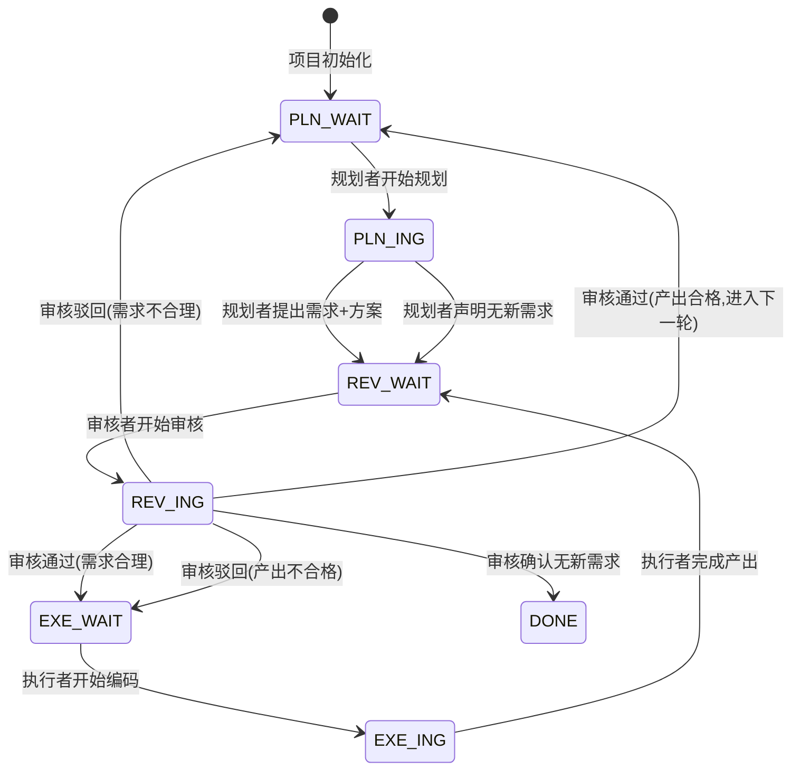

# AI 助力工作：工具与方法分享

> 分享人：张战罗
> 面向：组内同事
> 性质：讲稿与讲义，可配合演示（`ppt/index.html`，29 页）使用

---

## 写在前面

本次分享围绕「多任务并行」展开——把 AI 嵌入日常工作流程、让多个任务能自主推进且随时可控的具体实践。

引子从**杰文斯悖论**说起：瓦特改良蒸汽机后燃烧效率大幅提升，人们本以为英国煤炭消耗量会下降，结果恰恰相反——蒸汽机效率提高意味着获得同等动力的成本大幅降低，纺织厂、轮船、火车等千行百业纷纷采用，最终煤炭总消耗量迎来爆发式增长。编程同理：AI 让写代码的成本骤降，以前因成本太高而不做的事，现在都会涌现出来。需求变大，挑战就落在了效率提升上，而效率提升有赖于并行——这是本次分享的核心。

多任务并行有三个绕不开的问题：其一，**复杂任务仍然离不开人**——拆解、中途干预、检查，每个环节都要人把关；其二，**人的及时确认成为了效率瓶颈**——需要人拍板的地方，模型要么干等、要么自行其是；其三，**多任务切来切去烦**——几个任务同时跑，来回切换，走到哪、卡在哪都记不清。把这三个问题往下看一层，就是三个需求，也正是本次分享的三章，最后落在一点思考。内容对应：

1. **PRE 工程** —— 多智能体协作框架，对应「提升复杂任务处理能力 / 后台自主运行」（`src/pre-engineering-main`）
2. **第一时间触达** —— 决策弹窗与任务完成报告，对应「第一时间触达」
3. **Claude Code Agent Monitor** —— 会话实时监控面板，对应「实时监控」（`src/Claude-Code-Agent-Monitor-master`）
4. **一点思考** —— 变与不变

---

## 一、PRE 工程：多智能体协作框架

对应资源：`src/pre-engineering-main`
对应需求：提升复杂任务处理能力（后台自主运行）

### 1.1 项目初衷

名称源自「三个臭皮匠，顶个诸葛亮」，意在表达多个平凡智能体协作可胜过单一天才智能体。三个角色的英文名首字母构成 PRE：**P**lan（规划）、**R**eview（审核）、**E**xecute（执行）；同时 PRE 也是 preparation（准备）的缩写，表明其为项目启动提供准备材料的定位。

PRE 并非独立项目，而是为现有项目叠加的多智能体协作框架——相当于给项目配置一支分工明确、具备沟通渠道的智能体团队。

#### 解决的问题

单一智能体执行任务有三个典型问题：缺乏制衡，易沿错误方向持续推进；无质量把关，产出未经审核即定稿；长任务不可控，推进完成后才发现方向偏差。直接并行多个智能体同样不可行——缺乏协调机制的并行无法形成合力。PRE 给出的方案是**角色分工、协作文档通信、状态机驱动，并由监督者单点续跑**。

### 1.2 三角色分工

| 角色 | 推荐模型 | 职责 |
|------|----------|------|
| 规划者 Planner | 强推理模型 | 阅读目标与代码，拆解需求，制定方案 |
| 执行者 Executor | 快速编码模型 | 按方案编码实现 |
| 审核者 Reviewer | 细致审核模型 | 审核需求合理性与产出质量，驳回虚报 |

角色边界明确：规划者不写码，执行者不规划，审核者不实现——各司其职，互不越界。

### 1.3 协作文档

PRE 生成 5 份核心文档，存放于 `.pre/{项目名}/`：

1. **项目目标文档** —— 需求与约束，仅人工可修改，是项目方向的总开关。
2. **协作日志** —— 智能体间通信的唯一媒介，只追加不删除。
3. **规划者指导 / 执行者指导 / 审核者指导** —— 三个角色的行为规范与可声明状态。

协作日志的硬性规则（防止日志损坏）：

- 只追加不删除（append-only），禁止重写整个文件。
- 每条以 `## [时间] 角色 — 动作描述` 开头，以 `状态：<状态码>` 结尾。
- 每轮必须读取实际文件获取最新状态，不凭记忆、不假设上次状态仍有效。
- 状态验证通过后才行动，状态不匹配则跳过。

### 1.4 状态机驱动

系统定义 7 个状态码，每个状态下仅对应角色行动，其余角色跳过：

| 状态码 | 含义 | 行动者 |
|--------|------|--------|
| `PLN_WAIT` | 等待规划者提出需求或声明无新需求 | 规划者 |
| `PLN_ING` | 规划者正在制定方案 | 规划者 |
| `REV_WAIT` | 有内容待审核 | 审核者 |
| `REV_ING` | 审核者正在审核 | 审核者 |
| `EXE_WAIT` | 需求审核通过，等待执行 | 执行者 |
| `EXE_ING` | 执行者正在编码 | 执行者 |
| `DONE` | 所有需求已交付 | — |

状态流转构成闭环：



协作链路为：`PLN_WAIT → 规划者规划 → REV_WAIT → 审核者审核需求 → EXE_WAIT → 执行者执行 → REV_WAIT → 审核者审核产出 → PLN_WAIT`（下一轮）。状态码是智能体判断是否行动的唯一依据；审核驳回时回退到执行或规划，**同一需求连续驳回 3 次触发阻断**，回退至 `PLN_WAIT`，由规划者重新拆分或调整需求，执行者停止重试，以避免审核者与执行者无限拉锯。

### 1.5 监督者：单点续跑

早期方案是开三个终端、各自用 `/loop` 让三个角色轮转。问题在于：人会忘关、会断，一旦终端没盯住，循环就停了。

演进为**单点监督者**：一条 cron 定时触发，按 `state.json` 决定该拉起哪个角色。续跑用 headless 无界面方式接续既有会话：

```bash
claude -p --resume <session-id>
```

关掉终端也不丢上下文。三终端 → 单点 cron，闭环更稳。

### 1.6 三个机制：自主保障

| 机制 | 说明 |
|------|------|
| 目标变更检测 | 项目目标文档做 md5，一改方向自动重置，团队重读新目标 |
| 状态机闭环 | 状态码驱动流转，审核驳回回退到执行或规划，连续 3 次驳回阻断 |
| 只追加日志 | 协作日志 append-only，既是通信唯一媒介，也是事后审计依据 |

目标可改、状态可控、过程可审——自主才落得地。

### 1.7 真实案例：ros-ai-builder

一个真实跑过的项目：在昇腾 NPU 上做多卡强化学习训练 Transformer，求解车辆路径问题（VRP），基准对标开源 pyvrp（gap ≤ 10%、节点规模 200），里程碑用 HTML 汇报。PRE 接管后，`.pre/ros-ai/` 里的监督者按 `state.json` 拉起三角色自主跑，协作日志跑了 2344 行、28+ 轮，全程无人盯。

两个真实回合：

- **① 虚报被揪（第 6 轮）**：执行者声明 DDP SELF-TEST PASS、unserved 从 7 降到 0.08；审核者实测发现坍缩——unserved 9.69、loss 万级、reward -496，判定假 PASS 驳回。处置：修复后补 4 项防虚报断言，堵住「自报 PASS」。
- **② 改目标回正轨（第 20 轮）**：行为克隆（BC）蒸馏死循环，gap 飙到 235%；规划者援引历史决议，主动切换架构跳出死循环。处置：我在项目目标里加了一条「gap > 20% 换思路、参考 reference」的条款，方向被引导回正轨。

审核者防虚报、规划者纠偏、人只改目标——各司其职的具象。

### 1.8 安装与使用

安装：

```bash
npx skills add zhangzhanluo/pre-engineering
```

更新方式相同，重跑命令即覆盖至最新版，已有的 `.pre/{项目名}/` 协作文档不受影响（skill 模板与项目协作文档相互分离）。

使用流程：

1. 安装 skill。
2. 在 Claude Code 中表达多智能体协同意图，无需明确提及 PRE。
3. 自动识别中英文并确认。
4. 2 步交互，自动扫描 README、package.json 等推断需求以减少重复输入。
5. 生成 5 份文档至 `.pre/{项目名}/`，含项目专属绝对路径。
6. 监督者以 cron + `claude -p --resume` 单点续跑三角色，无需开三个终端。

实践要点：

- 模型选型匹配角色：规划者用强推理模型，执行者用快速编码模型，审核者用细致审核模型，依据职责而非绝对能力选择。
- `.pre/` 默认纳入 `.gitignore`，保证智能体始终可在磁盘读取协作文档；如需版本管理可手动取消忽略并提交基线。
- 安全检查：不覆盖已有文件、日志 append-only、项目目标文档受保护（智能体只读不改）。

---

## 二、第一时间触达：决策弹窗与任务完成报告

对应需求：第一时间触达

### 2.1 思路：把决策问题推到人面前

需要人拍板的地方，模型要么干等、要么自行其是，「等确认」就成了效率瓶颈。解决思路不是让模型自己猜，而是**把决策问题主动推到人面前**——一条写在 `CLAUDE.md` 里的规则，把「等你确认」变成「主动弹到你面前」。具体分两类：需要拍板的选择，走网页表单弹窗；复杂任务完成，自动生成报告并用浏览器弹出。

### 2.2 决策弹窗：decision-form.py

一个自包含的 Python 弹窗服务。机制是：用环境变量传参（标题 `DECISION_TITLE`、选项 `DECISION_OPTIONS`），后台起本地服务并自动开浏览器，用户勾选点「发布确认」，服务把结果写进一个带进程号的唯一 JSON 文件后退出，主进程轮询该文件取出 `{choice, note}`。

调用范式：

```bash
DECISION_TITLE="标题"
DECISION_OPTIONS='[{"label":"选项A","desc":"...","value":"a"},{"label":"选项B","desc":"...","value":"b"}]'
DECISION_NOTE=1 python3 ~/.claude/scripts/decision-form.py
```

关键三点（也是实况截图所示的体验，见 PPT P17）：

- **即开即选**：后台起服务自动开浏览器，不等不查。
- **进程隔离**：结果文件带进程号，多个会话同时弹窗也不会串台。
- **即选即退**：勾完点发布，服务写文件退出，主进程取结果。

底层是 `ThreadingHTTPServer`，监听 `127.0.0.1`，提交走 `POST /submit`。

### 2.3 任务完成报告：弹浏览器

复杂任务（3 步及以上的实质工作）完成时，按 `CLAUDE.md` 规则自动生成一份自包含单文件 HTML 报告，并用 `open` 弹出浏览器。报告要素：

- **形态**：单文件 HTML，自包含、内联 CSS、不外链资源，随带随看。
- **板块（五段式）**：指令总结 · 完成过程 · 完成结果 · 耗时统计 · 项目信息。
- **落位**：存到 `~/Documents/ZZLNote/ClaudeCode日志/任务报告/`。

价值：任务一完成就送达，人不必守在终端前等「做完了没」；决策一弹窗就拍板，不必在对话里来回打字确认。两点合起来，把「等人」这个瓶颈压到最小。

---

## 三、Claude Code Agent Monitor：会话实时监控面板

对应资源：`src/Claude-Code-Agent-Monitor-master`
对应需求：实时监控

### 3.1 项目定位

Claude Code Agent Monitor 是本地优先（local-first）的 Claude Code 会话实时监控面板。它并非云服务，运行在开发者本机，数据存储于本地 SQLite 文件。技术栈为 Node.js 18+、Express、React 18、Vite、TypeScript、better-sqlite3、WebSocket；可选组件包括本地 MCP server、VS Code 扩展与桌面应用（macOS/Windows）。

项目来自开源仓库（截至 2026-07：约 805 star / 181 fork / 656 commits，TypeScript，MIT 协议）。

### 3.2 工作原理

一条贯穿始终的数据流：

```
来源(Claude Code 会话) → 采集(Hook 触发) → 存储(SQLite) → 推送(WebSocket) → 呈现(React)
```

关键机制：

- **Hook 集成**：利用 Claude Code 原生 Hook 系统，会话事件（工具使用、停止等）自动 POST 至本地 Express 服务器。
- **WebSocket 推送**：服务器将变更实时推送至前端，UI 自动刷新。
- **数据自主**：数据存于本地 SQLite，不上传，适用于有数据合规要求的场景。

### 3.3 主要能力

| 模块 | 能力 |
|------|------|
| Dashboard 总览 | 统计数据、活跃智能体卡片、最近活动流 |
| Kanban 看板 | 智能体按状态分列：工作中 / 等待中 / 已完成 / 错误；会话视图分 5 列，「等待中」列直观呈现被阻塞的会话 |
| 会话管理 | 费用、模型、智能体数量、时长，服务端分页、可搜索可过滤 |
| 会话详情 | Agent / Conversation / Timeline 标签页，含对话查看、事件时间线、子智能体层级树 |
| 活动流 | 实时事件日志，支持暂停/恢复、分组、多维过滤 |
| 分析 | 按模型的 Token 用量、工具使用频率、活动热力图、会话趋势 |
| 工作流 | 智能体编排 DAG、工具执行桑基图、协作网络 |
| 系统健康 | 健康评分、存储引擎、缓存/错误/成功率、子智能体效能、模型 Token 分布（每 5 秒刷新） |
| 多语言 | en / zh / vi |
| 通知 | 浏览器通知、更新提醒、连接状态弹窗 |

### 3.4 使用方式与价值

核心命令：

```bash
npm run setup                 # 首次安装
npm run dev                   # 开发模式
npm run build && npm start    # 生产构建与启动
```

安装后配置 Claude Code 的 hook，使会话事件上报至本地服务器即可。

价值：把智能体在后台的执行过程可视化，每一步、每个工具调用都看得见；看板「等待中」列直接暴露因权限请求或等待输入而阻塞的会话；Token 用量与费用统计使成本可观测；多智能体编排视图可配合协作框架（PRE）呈现协作链路。多个任务同时跑时，这就是「实时监控」的落点。

---

## 四、一点思考

封章语：在正确的路上做对的事情。

### 4.1 变与不变

**问题**：在工具快速迭代、模型能力持续提升的背景下，如何区分需要深入研究的稳定问题与可被模型能力提升解决的问题？

**问题来源**：当下投入大量精力搭建的工具与技巧，可能随模型升级而失去价值；若不分主次地深入所有环节，精力会被消耗在可被替代的部分，而稳定的工程方法论反而投入不足。

**重要性**：时间与精力有限，投入方向决定长期收益。识别方法论中「不变」的部分与技巧中「可被替代」的部分，是将精力配置于复利点的前提，决定了个人在 AI 能力快速演进中能否持续有效产出。投入于「不变」的工程方法论，是穿越模型迭代的复利点。

### 4.2 一个例子：四代范式

提示工程这些年走过四代，每一代都曾费心搭建，如今收益却在层层消退：

| 代 | 范式 | 曾经 | 如今 |
|----|------|------|------|
| 01 | PROMPT 提示词工程 | 精心调教每一句问法 | 模型自能理解，调教收益递减 |
| 02 | CONTEXT 上下文工程 | 费力裁剪背景与记忆 | 长上下文模型自动容纳 |
| 03 | HARNESS 约束工程 | 细抠规则与工具边界 | 模型更自主，硬约束渐松 |
| 04 | LOOP 循环工程 | — | 仍是当前范式，但搭法越走越轻，苦工正被更强的模型抹平 |

去年的技术路线，今年就已经不需要了——这正是「变」的具象。模型越强，越早的范式越没意义。

### 4.3 礁石与船

借磊哥「礁石与船」的论点：

- **礁石**：业务逻辑——可被 AI 完全替代的能力。智能潮水上涨，礁石最终被淹没。
- **船**：能利用 AI 放大自身价值的能力。水涨船高，成为技术进步的受益者。
- **潮水**：大模型的智能水平。

时刻想清楚：自己正在做的，是会被淹没的礁石，还是能借势上行的船。

---

## 结语

从杰文斯悖论出发，需求变大把挑战压到了效率，而效率的提升有赖于多任务并行。本次分享围绕三个绕不开的需求展开：用 PRE 工程让复杂任务能自主推进、用决策弹窗与报告把「等人」瓶颈压到最小、用 Agent Monitor 让多个会话的运行细节随时可见；最后落在变与不变——把精力投在穿越模型迭代的「不变」上，做那艘能借势上行的船。

借用上海交大原校长张杰院士的话作结：**未来已来，唯变不变。**

---

## 附录：资源索引

| 主题 | 路径 |
|------|------|
| PRE 工程框架 | `src/pre-engineering-main`（`SKILL.md` 为定义，`references/zh/` 为中文模板） |
| Claude Code Agent Monitor | `src/Claude-Code-Agent-Monitor-master`（`README-CN.md` 为中文文档） |
| 决策弹窗服务 | `~/.claude/scripts/decision-form.py` |
| 本次分享大纲 | `一些想法.md` |
| 本次分享演示 | `ppt/index.html`（29 页，瑞士国际主义风） |
| 本次分享文档 | `分享文档.md`（本文件） |
