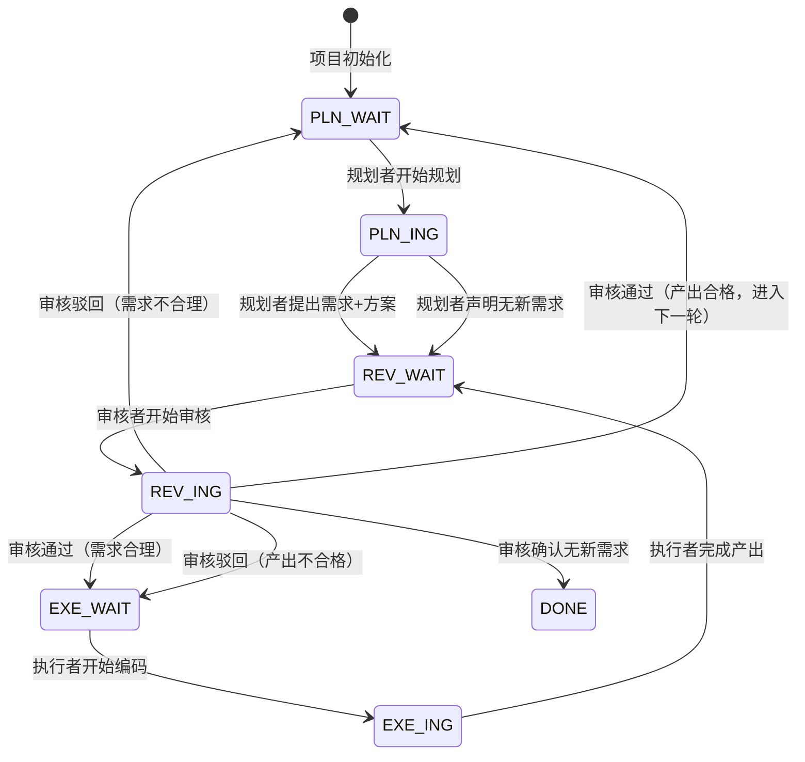

# AI 助力工作：工具与方法分享

> 分享人：张战罗
> 面向：组内同事
> 性质：讲稿与讲义，可配合演示使用

---

## 写在前面

本次分享围绕几件实际在用的工具与方法展开，主题是把 AI 嵌入日常工作流程的具体实践。内容分为四部分：

1. **用 LaTeX 写文档** —— 一个自制的技术文档模板（`src/tech-report-template`）
2. **PRE 工程** —— 一套多智能体协作框架（`src/pre-engineering-main`）
3. **Claude Code Agent Monitor** —— Claude Code 会话的实时监控面板（`src/Claude-Code-Agent-Monitor-master`）
4. **一些思考** —— 实践过程中浮现的若干问题

---

## 一、用 LaTeX 写文档

对应资源：`src/tech-report-template`

### 1.1 LaTeX 的优势、局限与适用场景

#### 优势

| 优势 | 说明 |
|------|------|
| 排版质量高 | 公式、表格、代码块、流程图的渲染质量稳定且专业 |
| 样式与内容分离 | 样式集中在 `.cls`，内容写在 `.tex`；换皮不动内容，团队统一风格成本低 |
| 纯文本源码 | 可用 git 做版本管理，diff 清晰可追溯 |
| 自动化 | 目录、图录、表录、交叉引用、编号自动生成，增删内容后编译即可 |
| 对 AI 协作友好 | LaTeX 本质是结构化纯文本，AI 生成与修改的可控性优于二进制文档格式 |
| 多端输出 | 主输出为 PDF，可转换为 Word/HTML |

#### 局限

| 局限 | 说明 |
|------|------|
| 学习成本高 | 需掌握命令、环境、浮动体等概念 |
| 环境配置繁琐 | TeX Live/MacTeX 体积较大，宏包管理存在门槛 |
| 报错信息晦涩 | 编译报错对初学者不友好 |
| 非所见即所得 | 修改后需编译才能查看效果，反馈循环较慢 |
| 协作不如在线文档 | 多人合并需各自编译，批注评审不如在线文档便利 |
| 评审者看源码困难 | 非技术同事只能阅读 PDF，无法在源文件上批注 |

#### LaTeX、Word、Markdown 对比

| 维度 | LaTeX | Word | Markdown |
|------|-------|------|----------|
| 排版质量（公式/表格/代码） | 高 | 中 | 低，依赖渲染器 |
| 源码形态 | 纯文本 | 二进制（.docx 为压缩 XML） | 纯文本 |
| 版本管理（git diff） | 优秀，diff 清晰 | 困难 | 优秀 |
| AI 协作友好度 | 高，结构化文本可控 | 低，操作 .docx 较复杂 | 高 |
| 学习成本 | 高 | 低 | 低 |
| 协作与批注评审 | 需各自编译，源码评审不便 | 批注友好，在线协作成熟 | 取决于托管平台 |
| 自动化（目录/引用/编号） | 自动 | 半自动 | 取决于工具链 |
| 多端输出 | PDF / HTML / Word | docx / pdf | 多端 |
| 适用场景 | 正式技术报告、含公式与算法、需归档版本 | 评审流程为主、非技术人员深度参与、快速出稿 | 内部文档、Wiki、轻量笔记 |

需要说明的是，当评审者只阅读 PDF 时，"评审者看源码困难"这一局限即不构成障碍——交付物为 PDF，源码由作者自行维护。此时主要门槛在于作者需具备 LaTeX 基础，而该门槛可在 AI 辅助下显著降低。

### 1.2 环境准备

模板要求使用 **xelatex**（中文支持），不支持 pdflatex。

前置依赖：

| 依赖 | 说明 |
|------|------|
| TeX Live / MacTeX | 推荐 2023 及以上版本，需包含 xelatex |
| ctex | 中文排版支持（通常随发行版安装） |
| tabularx | 表格伸缩列 |
| tcolorbox + listings | 代码块渲染 |
| gbt7714 | GB/T 7714-2015 参考文献样式（需单独安装） |
| csquotes / algorithm + algpseudocode | 引号 / 伪代码 |

安装缺失宏包（以 gbt7714 为例）：

```bash
tlmgr install gbt7714
```

编辑器选用 VS Code 搭配 LaTeX Workshop 插件。模板自带 `.vscode/settings.json`，已配置 xelatex 工具与 recipe，打开 `.tex` 文件即可编译预览：

- 编译：`Cmd+Option+B`（macOS）/ `Ctrl+Alt+B`（Windows/Linux）
- 预览：`Cmd+Option+V` / `Ctrl+Alt+V`

另配置 `.latexmkrc`，可使用 latexmk 一键编译。

编译次数需注意：不含参考文献时编译 2 次 xelatex；含参考文献时需 4 步。

```bash
# 含参考文献的四步编译
xelatex techreport.tex
bibtex  techreport
xelatex techreport.tex
xelatex techreport.tex
```

| 常见问题 | 解决方法 |
|----------|----------|
| 中文乱码 | 必须使用 xelatex，不可用 pdflatex |
| 目录或引用显示 `??` | 编译次数不足，再编译一到两次 |
| 找不到 .cls 文件 | 确认 `techreport.cls` 与 `.tex` 位于同一目录 |
| 找不到宏包 | `tlmgr install <包名>` 安装缺失宏包 |

### 1.3 Hello World

以下为不依赖任何模板的最小可编译示例，使用 `ctexart` 文档类，以 xelatex 编译：

```latex
\documentclass{ctexart}

\title{文档标题}
\author{作者}
\date{\today}

\begin{document}
\maketitle
\tableofcontents

\section{概述}
这是一份最小可编译的 \LaTeX{} 文档。

\subsection{公式示例}
行内公式 $E = mc^2$，独立公式：
\begin{equation}
    \int_a^b f(x)\,dx = F(b) - F(a)
\end{equation}
\end{document}
```

编译两次以生成目录与交叉引用：

```bash
xelatex demo.tex
xelatex demo.tex
```

该示例展示了 LaTeX 文档的基本结构：`\documentclass` 声明文档类，导言区设置标题等信息，`\begin{document}` 与 `\end{document}` 之间为正文，包含标题生成、目录、章节与公式等基本元素。

### 1.4 自制模板 tech-report-template

设计理念为样式与内容分离：`techreport.cls` 管理样式（不应手动修改），`techreport.tex` 编写内容。

#### 设计目标

将团队常用的封面、评审表、修改记录、页码规则、表格风格、代码块风格等固化于 `.cls`，使编写者只需关注内容。相比通用论文模板，本模板面向中文技术文档场景，内嵌公司要素与 GB/T 7714 参考文献样式。

#### 封面

`\makecover` 采用键值参数，封面状态复选框根据 `status` 自动勾选：`draft`（草稿）、`formal`（正式）、`revising`（修订中）。

#### 已封装能力

| 维度 | 能力 |
|------|------|
| 封面 | title/subtitle/status/version/author/id/secret/logo 键值参数，状态复选框自动勾选 |
| 页码 | 双页码系统：前置文档罗马数字，正文阿拉伯数字 |
| 标题 | 4 级标题，目录显示前 3 级 |
| 前置文档 | 评审表 / 修改记录 / 参考文档（均可选） |
| 图录/表录 | 自动生成，条目带"图""表"前缀 |
| 表格 | `tabularx` 自动宽度、Y/X 列类型、三线表、长表格（跨页与表头续页重复） |
| 公式 | 行内 / 独立 / 中文标注 / 多行 / 矩阵 |
| 图片 | 插入 / 交叉引用 / 并排 |
| 代码块 | listings + tcolorbox，语法高亮、标题、下划线正确渲染 |
| 流程图 | TikZ 绘制（节点定位采用 `below=of` 语法） |
| 列表 | 有序 / 无序 / 嵌套（enumitem nosep 紧凑模式） |
| 参考文献 | gbt7714（GB/T 7714-2015 顺序编码制） |
| 伪代码 | algorithm + algpseudocode，标签中文化（输入/输出/算法） |
| 浮动体 | FloatBarrier 阻止表格与图片跨节漂移 |

模板的 `.tex` 既是源码也是示例文档，编译后即可查看效果并对照示例编写。模板的完整使用说明即为编译产物 `techreport.pdf`。

#### 设计原则

以下原则源自模板的工程文档，是实践验证后的结论：

1. 样式保持简单，避免复杂排版特性，以保证 PDF 转 Word 后仍具可读性。
2. 优先使用标准 LaTeX 机制（table/figure/caption），而非自定义实现，以提升稳定性。
3. 浮动体通过引用关联（`见表~\ref{tab:xxx}`），不依赖"如下"等引导语，避免内容增删后引导语失效。
4. 样式与内容分离，便于团队统一风格与版本管理。

### 1.5 用 AI 辅助画图

文档中的配图推荐由 AI 生成"图的代码"而非"图的图片"。

直接生成图片存在三个问题：不可编辑，修改需重画；文字易出错，尤其中文与代码；不可版本管理，二进制图片无法 diff。

推荐做法是让 AI 生成可渲染的代码：

| 图的类型 | 推荐工具 | 特点 |
|----------|----------|------|
| 流程图 / 时序图 | Mermaid | 文本即图，主流文档平台原生渲染 |
| UML / 架构图 | PlantUML | 表达力强，适合软件设计图 |
| 嵌入 LaTeX 的流程图 | TikZ | 与文档风格统一，矢量 |
| 数据图 | Python matplotlib / Excel | 数据驱动，可复现 |

实践链路为：将文字需求提交给 AI，由其产出 Mermaid 或 TikZ 代码，经人工校验与微调后渲染或嵌入文档。其优势为矢量化、可版本管理、修改便捷、风格统一。

---

## 二、PRE 工程：多智能体协作框架

对应资源：`src/pre-engineering-main`

### 2.1 项目初衷

名称源自"三个臭皮匠，顶个诸葛亮"，意在表达多个平凡智能体协作可胜过单一天才智能体。三个角色的英文名首字母构成 PRE：**P**lan（规划）、**R**eview（审核）、**E**xecute（执行）；同时 PRE 也是 preparation（准备）的缩写，表明其为项目启动提供准备材料的定位。

#### 解决的问题

单一智能体执行任务存在三个典型问题：缺乏制衡，易沿错误方向持续推进；无质量把关，产出未经审核即定稿；长任务不可控，推进完成后才发现方向偏差。

直接并行多个智能体同样不可行，缺乏协调机制的并行无法形成合力。PRE 给出的方案为角色分工、协作日志通信与状态机驱动。

PRE 并非独立项目，而是为现有项目叠加的多智能体协作框架，可理解为给项目配置一支分工明确、具备沟通渠道的智能体团队。

### 2.2 核心设计

核心由三部分构成：三角色分工、协作日志通信、状态机驱动。

#### 三角色分工

| 角色 | 推荐模型 | 职责 |
|------|----------|------|
| 规划者 Planner | 强推理模型 | 阅读目标与代码，拆解需求，制定方案 |
| 执行者 Executor | 快速编码模型 | 按方案编码实现 |
| 审核者 Reviewer | 细致审核模型 | 审核需求合理性与产出质量，驳回冗余与膨胀 |

角色边界明确：规划者不写码，执行者不规划，审核者不实现。

#### 协作日志

PRE 生成 5 份核心文档，存放于 `.pre/{项目名}/`：

1. **项目目标文档** —— 需求与约束，仅人工可修改，是项目方向的总开关。
2. **协作日志** —— 智能体间通信的唯一媒介，初始包含 `PLN_WAIT` 条目。
3. 规划者指导 / 执行者指导 / 审核者指导 —— 三个角色的行为规范。

协作日志的硬性规则（防止日志损坏）：

- 只追加不删除（append-only），禁止重写整个文件。
- 每条以 `## [时间] 角色 — 动作描述` 开头，以 `状态：<状态码>` 结尾。
- 每轮必须读取实际文件获取最新状态，不凭记忆、不假设上次状态仍有效。
- 状态验证通过后才行动，状态不匹配则跳过。

#### 状态机驱动

系统定义 7 个状态码，每个状态下仅对应角色行动，其余角色跳过：

| 状态码 | 含义 | 行动者 |
|--------|------|--------|
| `PLN_WAIT` | 等待规划者提出需求或声明无新需求 | 规划者 |
| `PLN_ING` | 规划者正在制定方案 | 规划者 |
| `REV_WAIT` | 有内容待审核 | 审核者 |
| `REV_ING` | 审核者正在审核 | 审核者 |
| `EXE_WAIT` | 需求审核通过，等待执行 | 执行者 |
| `EXE_ING` | 执行者正在编码 | 执行者 |
| `DONE` | 所有需求已交付 | — |

状态流转如下：



协作链路为：

```
PLN_WAIT → 规划者规划 → REV_WAIT → 审核者审核需求 → EXE_WAIT → 执行者执行 → REV_WAIT → 审核者审核产出 → PLN_WAIT（下一轮）
```

状态码是智能体判断是否行动的唯一依据。三方各自轮询日志，状态匹配则行动，不匹配则跳过。该设计以一个 append-only 文本文件与 7 个状态码实现多智能体协同，无需锁与消息队列。

#### /loop 驱动

三个角色各开一个终端，以 `/loop 3m` 每 3 分钟轮询协作日志：

```
/loop 3m "读 {项目路径}/.pre/{项目名}/规划者指导.md 并作为规划者执行。每轮先读协作日志确认最新状态。"
```

每轮先读取日志，状态匹配则行动并写入新条目、更新状态码；三个 loop 各自记录 job ID 至协作日志以便核对。

#### 防死循环

同一需求连续驳回 3 次即触发阻断，回退至 `PLN_WAIT`，由规划者重新拆分或调整需求，执行者停止重试，以避免审核者与执行者无限拉锯。

#### 版本记录

审核者审核通过产出后直接 git commit（不使用 stash），版本格式为 `V{日期}-{时间} V{语义版本}`，如 `V20260514-1637 V0.3.4`，版本信息从项目的 `VERSIONS.md` 或 `CHANGELOG.md` 自动推断。

#### 人工控制

通过修改项目目标文档控制项目，规划者在下一轮自动识别：

| 意图 | 操作 | 智能体响应 |
|------|------|-----------|
| 调整方向 | 修改项目目标文档 | 规划者下一轮调整计划 |
| 缩减范围 | 删除需求条目 | 规划者提交"无新需求" |
| 增加需求 | 增加条目 | 规划者识别并提议 |
| 暂停 | 在 Notes 中标注"暂停中" | 规划者识别并跳过 |

### 2.3 安装与使用

安装：

```bash
npx skills add zhangzhanluo/pre-engineering
```

更新方式相同，重跑命令即覆盖至最新版，已有的 `.pre/{项目名}/` 协作文档不受影响（skill 模板与项目协作文档相互分离）。

使用流程：

1. 安装 skill。
2. 触发：在 Claude Code 中表达多智能体协同意图，无需明确提及 PRE。
3. 语言检测：自动识别中英文并确认。
4. 需求收集：2 步交互，自动扫描 README、package.json 等推断需求以减少重复输入。
5. 生成 5 份文档至 `.pre/{项目名}/`，含项目专属绝对路径。
6. 开 3 个终端以 `/loop` 启动三个角色，使用绝对路径无需切换目录。
7. 记录 job ID：各角色自动将 loop job ID 写入协作日志。

### 2.4 实践要点

- 模型选型匹配角色：规划者使用强推理模型，执行者使用快速编码模型，审核者使用细致审核模型，依据职责而非绝对能力选择。
- `.pre/` 默认纳入 `.gitignore`，保证智能体始终可在磁盘读取协作文档；如需版本管理可手动取消忽略并提交基线。
- 安全检查：不覆盖已有文件、日志 append-only、项目目标文档受保护（智能体只读不改）。

---

## 三、Claude Code Agent Monitor：会话实时监控面板

对应资源：`src/Claude-Code-Agent-Monitor-master`

### 3.1 项目定位

Claude Code Agent Monitor 是本地优先（local-first）的 Claude Code 会话实时监控面板。其并非云服务，运行于开发者本机，数据存储于本地 SQLite 文件。

技术栈为 Node.js 18+、Express、React 18、Vite、TypeScript、better-sqlite3、WebSocket。可选组件包括本地 MCP server、VS Code 扩展与桌面应用（macOS/Windows）。

### 3.2 工作原理

系统由一条贯穿始终的数据流构成：


关键机制：

- **Hook 集成**：利用 Claude Code 原生 Hook 系统，会话事件自动 POST 至本地 Express 服务器。
- **WebSocket 推送**：服务器将变更实时推送至前端，UI 自动刷新。
- **数据自主**：数据存储于本地 SQLite，不上传，适用于有数据合规要求的场景。

### 3.3 主要能力

| 模块 | 能力 |
|------|------|
| Dashboard 总览 | 统计数据、活跃智能体卡片、最近活动流 |
| Kanban 看板 | 智能体按状态分列：工作中 / 等待中 / 已完成 / 错误；会话视图分 5 列。"等待中"列可直观呈现被阻塞的会话 |
| 会话管理 | 费用、模型、智能体数量、时长，服务端分页、可搜索可过滤 |
| 会话详情 | Agent / Conversation / Timeline 标签页，含对话查看、事件时间线、子智能体层级树 |
| 活动流 | 实时事件日志，支持暂停/恢复、分组、多维过滤 |
| 分析 | 按模型的 Token 用量、工具使用频率、活动热力图、会话趋势 |
| 工作流 | 智能体编排 DAG、工具执行桑基图、协作网络 |
| 系统健康 | 健康评分、存储引擎、缓存/错误/成功率、子智能体效能、模型 Token 分布（每 5 秒刷新） |
| 多语言 | en / zh / vi |
| 通知 | 浏览器通知、更新提醒、连接状态弹窗 |

Dashboard 总览界面：


Kanban 看板（智能体视图），"等待中"列突出显示被阻塞的会话：


### 3.4 使用方式与价值

核心命令：

```bash
npm run setup                 # 首次安装
npm run dev                   # 开发模式
npm run build && npm start    # 生产构建与启动
```

安装完成后配置 Claude Code 的 hook，使会话事件上报至本地服务器即可。

其价值在于：将智能体在后台的执行过程可视化，便于掌握每一步与每个工具调用；看板的"等待中"列直接暴露因权限请求或等待输入而阻塞的会话；Token 用量与费用统计使成本可观测；多智能体编排视图可配合协作框架呈现协作链路。

---

## 四、一些思考

本节列出实践过程中浮现的若干问题，仅作问题陈述。

### 4.1 个人知识库

**问题**：在 AI 辅助工作的过程中，个人积累的经验、决策与教训如何沉淀为可复用、且能被 AI 检索利用的知识资产？

**问题来源**：工作过程中的经验散落于对话记录、本地笔记与个人记忆中，缺乏结构化的保存与复用机制；AI 每次介入若缺少背景上下文，需从零理解，沟通成本重复发生。

**重要性**：知识的可复用性决定了 AI 协作的边际成本。若缺乏沉淀机制，每次协作都需重新沟通背景，积累无法形成复利；反之，结构化的知识资产可被 AI 持续调用，使个人能力随时间累加而非归零。

### 4.2 skill 的稳定调用

**问题**：如何保证 skill 在需要的场景被稳定触发，在不需要的场景不误触？

**问题来源**：skill 的调用依赖模型对其 description 的理解与匹配，描述方式（关键词枚举与自然表达覆盖）直接影响触发率；描述不当会导致该触发时不触发、不该触发时误触发，能力呈现不稳定状态。

**重要性**：skill 是将工作流固化为可复用资产的关键机制。若调用不稳定，资产无法被可靠复用，相当于具备工具却无法在需要时启用，其价值难以兑现。

### 4.3 多智能体协同与各司其职

**问题**：多个智能体并行工作时，如何保证各自职责清晰、不冲突、不重复、不互相覆盖？

**问题来源**：多个智能体共享同一工作空间（文件系统、代码库），若无协调机制会产生竞态、重复劳动与互相覆盖；单一智能体在缺乏制衡时也易沿偏差方向持续推进。

**重要性**：多智能体是放大 AI 产能的方向，但协调机制的复杂度往往抵消并行的收益。缺乏可靠的各司其职机制时，多智能体的管理难度反而高于单一智能体，并行非但不能提升效率，还可能引入额外的冲突成本。

### 4.4 变与不变

**问题**：在工具快速迭代、模型能力持续提升的背景下，如何区分需要深入研究的稳定问题与可被模型能力提升解决的问题？

**问题来源**：当下投入大量精力搭建的工具与技巧，可能随模型升级而失去价值；若不分主次地深入所有环节，精力会被消耗在可被替代的部分，而稳定的工程方法论反而投入不足。

**重要性**：时间与精力有限，投入方向决定长期收益。识别工程方法论中"不变"的部分与具体技巧中"可被替代"的部分，是将精力配置于复利点的前提，决定了个人在 AI 能力快速演进中能否持续保持有效产出。

---

## 结语

上述四部分分别对应文档产出的形态、多智能体的协作方式、执行过程的可视化，以及实践中的开放问题。工具会迭代，模型会升级，但如何将 AI 嵌入工程流程、如何使多智能体可靠协作、如何沉淀可复用资产，仍是值得持续投入的方向。以上为本次分享的全部内容。

---

## 附录：资源索引

| 主题 | 路径 |
|------|------|
| LaTeX 技术文档模板 | `src/tech-report-template`（`techreport.pdf` 为完整使用说明） |
| PRE 工程框架 | `src/pre-engineering-main`（`SKILL.md` 为定义，`references/zh/` 为中文模板） |
| Claude Code Agent Monitor | `src/Claude-Code-Agent-Monitor-master`（`README-CN.md` 为中文文档） |
| 本次分享大纲 | `一些想法.md` |
| 本次分享文档 | `分享文档.md`（本文件） |
